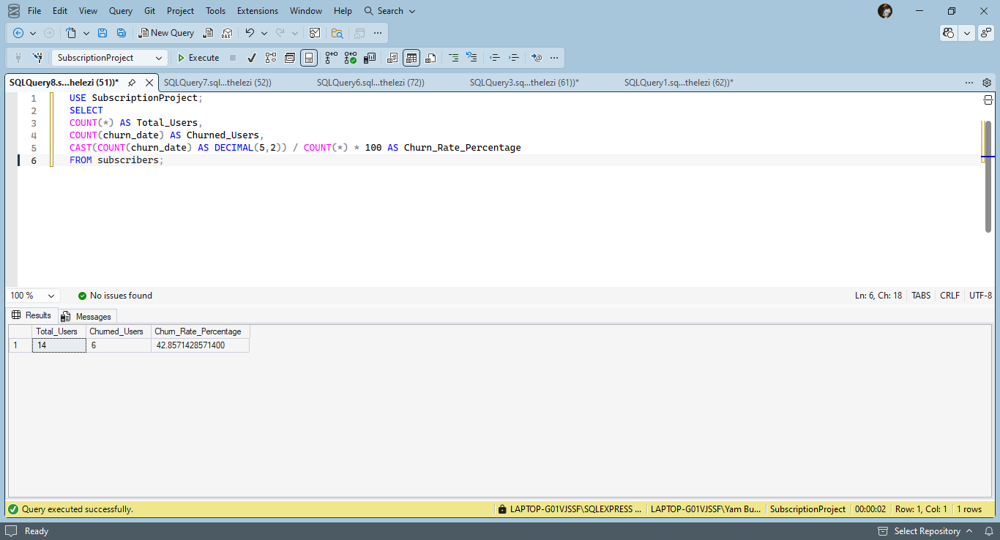
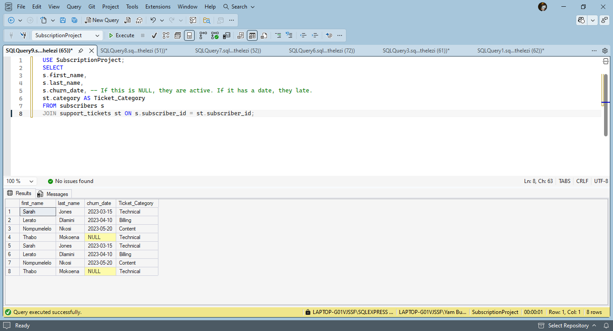

# Subscription Business Analysis (Churn & Retention)

## 📖 Project Overview

This project simulates a data analysis scenario for a subscription-based company (e.g., a streaming service). The primary goal was to analyze **customer churn rates** and identify potential drivers for customer attrition using SQL.

As a Data Analyst, understanding retention is critical. This project demonstrates the ability to design a relational database, populate it with mock data, and derive actionable business insights.

## 🛠️ Tools & Technologies

-   **Database:** Microsoft SQL Server (T-SQL)
-   **IDE:** SQL Server Management Studio (SSMS)
-   **Version Control:** Git & GitHub

## 🗄️ Database Schema

The database consists of three normalized tables to ensure data integrity:

1.  **`subscribers`**: Stores customer demographics and subscription status.
    -   _Key Fields:_ `subscriber_id`, `signup_date`, `churn_date` (NULL if active), `subscription_type`.
2.  **`monthly_revenue`**: Tracks monthly payment history.
    -   _Key Fields:_ `subscriber_id`, `revenue_date`, `amount`.
3.  **`support_tickets`**: Logs customer complaints or issues.
    -   _Key Fields:_ `subscriber_id`, `category` (Technical, Billing, Content).

## 📊 Key Business Insights

### 1\. Overall Churn Rate

Calculated the percentage of customers who cancelled their subscriptions.

-   **Result:** **42.85%** Churn Rate.
  
  
-   _SQL Concepts Used:_ `COUNT()`, `NULL` handling, `CAST()` (to calculate precise percentages).

### 2\. Support Tickets & Churn Correlation

Analyzed the relationship between customer support interactions and cancellation.

-   **Finding:** A significant percentage of customers who logged support tickets eventually churned.
-   _Observation:_ Users with 'Billing' and 'Content' issues churned, while users with 'Technical' issues (like Thabo) sometimes stayed.

  
-   _SQL Concepts Used:_ `JOIN` (Inner Join), `GROUP BY`.

## 🚀 How to Run

1.  Clone this repository.
2.  Open `Create.sql` in SSMS and execute to create the tables.
3.  Open `Populate.sql` and execute to populate the data.
4.  Run queries from `Churn_Rate.sql` and `Subscription_Analysis` to view the insights.

## 📁 File Structure

-   `Create.sql` - Database and table creation scripts.
-   `Populate.sql` - Mock data insertion.
-   `Churn_Rate.sql` and `SQL_Subscription_Analysis` - Analytical queries for churn and retention.
-   `README.md` - Project documentation.

**How to save this:**

1.  Go to your `SQL_Subscription_Analysis` folder.
2.  Create a new text file.
3.  Name it `README.md` (make sure you remove the `.txt` ending).
4.  Paste the text above inside and save.
